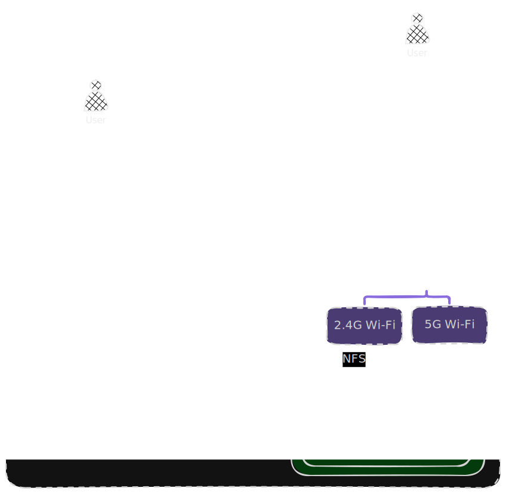

It all began years ago with an old desktop sitting under a desk, running a handful of self-hosted apps held together by a disorganized collection of `docker-compose.yml` files scattered across random directories.
It worked fine for a while, but a series of issues - from a bad update to a corrupted drive - quickly exposed the limits of an improvised setup.

The turning point came when my home lab evolved from a solo playground to the digital core of my household.
With my family relying on this infrastructure for daily necessities like password management, photo storage, and home automation, unexpected downtime stopped being a fun troubleshooting puzzle and became a disruption.
Driven by a need for stability and structure, I completely overhauled the architecture.

A lot has changed since then, but here's a tour of what my setup looks like today.

## Core Design Principles

Before diving into the hardware and software components, I established a set of design goals and principles to guide the build of my home lab.

### 1. Security-First

**Zero public exposure**: The golden rule of the setup is a strict "no exposed ports" policy.
Instead of exposing services to the Internet, all ingress traffic is handled through secure VPN tunnels.

**Restricted connectivity**: All services and devices are segmented into distinct network security zones, which determine their inbound/outbound connectivity. 

**Strong authentication**: Use strong authentication mechanisms such as Multi-Factor Authentication (MFA) where possible.

**Regular updates**: All Operating Systems and applications are regularly updated to ensure known vulnerabilities are mitigated swiftly.

These measures help to minimize the home lab's overall attack surface and limit the potential impact of any potential threats.

### 2. Cost-Efficient and Sustainable

#### Hardware: Resource-Optimized Infrastructure

As the home lab will be operating in a residential space, it needs to be power-efficient and have low thermal and noise footprint.
Because the infrastructure will be serving a small number of users, I prioritized resource efficiency over raw performance:
- **Performance per watt**: Low-power, high-efficiency hardware was selected over power-hungry rack servers to keep utility costs low and the setup sustainable.
- **Light-weight virtualization**: The architecture leans heavily on light-weight options such as LXCs and Docker containers over VMs.
  This drastically reduces resource overhead, allowing for a much higher density of services deployed on a single bare-metal host.

#### Software: Free and Open-Source Software (FOSS) Ecosystem

The software ecosystem is anchored on FOSS projects that are backed by strong community support and active development.
Adopting FOSS provides advantages such as:
- **Eliminating vendor lock-in**: This allows the flexibility to switch to a different provider or software stack.
- **No expensive licensing costs**: Eliminating licensing and recurring subscription fees ensures that the home lab remains cost-effective and sustainable.
- **Enhanced privacy**: FOSS alternatives tend to be more privacy-friendly. This helps to avoid intrusive telemetry, tracking, and collection of user data, which is common in proprietary solutions.
- **Better extensibility**: Built around open standards and robust APIs, open-source tools allow for highly customized workflows and automations which can help in the maintainability of the home lab.

### 3. Self-Hostable and Local-First Architecture

Every deployed service must be self-hostable and operate on a local-first architecture.
The service must be able to function offline and able to operate independently without connecting to the Internet for cloud services or external APIs.

While Internet connectivity is still required for software updates, all processing and storage must be done locally.

### 4. Simple and Maintainable

I didn't want the maintenance of my home lab to become a second full-time job.
While enterprise-grade orchestration platforms like Kubernetes offer undeniable advantages, the resource overheads and complexity of maintaining them far outweigh the benefits for a home lab environment.
Instead, I focused on a leaner architecture and leveraged automation wherever possible to minimize repetitive tasks and keep maintenance hassle-free.

## Infrastructure Overview

Guided by the above design principles, I set out to build my ideal home lab.
Here's a high-level overview of the resulting infrastructure:

| Layer   | Tech Stack      | Core Function                                                                                                                                                                     |
|---------|-----------------|-----------------------------------------------------------------------------------------------------------------------------------------------------------------------------------|
| Compute | Proxmox         | **Type-1 Hypervisor** that manages **Linux Containers (LXCs)** and **Virtual Machines (VMs)**.                                                                                    |
| Storage | BTRFS           | **Network Attached Storage (NAS)** that uses the **BTRFS filsystem** to provide centralized high-capacity, persistent storage, configured with **RAID** mirroring for redundancy. |
| Network | OPNsense        | Gateway handling **VPN**, **DNS**, **Reverse Proxying** and network security through **Firewall Policies** (security zones & VLANs).                                              |
| Apps    | Komodo + Docker | Komodo as the **Container Management Platform** for managing **Docker Container** lifecycles and automated app updates.                                                           | 

The illustration below shows how these layers interconnect, color-coded by domain:
purple for  **networking**,
orange for **compute**,
green for **storage**,
and blue for **applications and services**.

To see these layers in action, here's a sample walkthrough of what happens when a user accesses an app in the home lab:
1. The user enters the app URL in their web browser, initiating domain name resolution using the network's DNS server.
2. The DNS server resolves the hostname from the URL and replies with the IP address of the reverse proxy (Caddy).
3. The user's web browser sends the request to Caddy which handles the SSL handshake.
4. After completing the SSL connection, Caddy evaluates the host-based routing rules and forwards the request to the designated backend application which runs as a Docker container within a Proxmox VM/LXC.
5. The application processes the request, interacting with the NAS using the NFS protocol for persistent data operations.

## Coming Up Next

Now that we've covered the high-level architecture, we’re ready to do dive deeps into the individual components.
In the next post, we'll take a look at the Compute layer.
Stay tuned!
